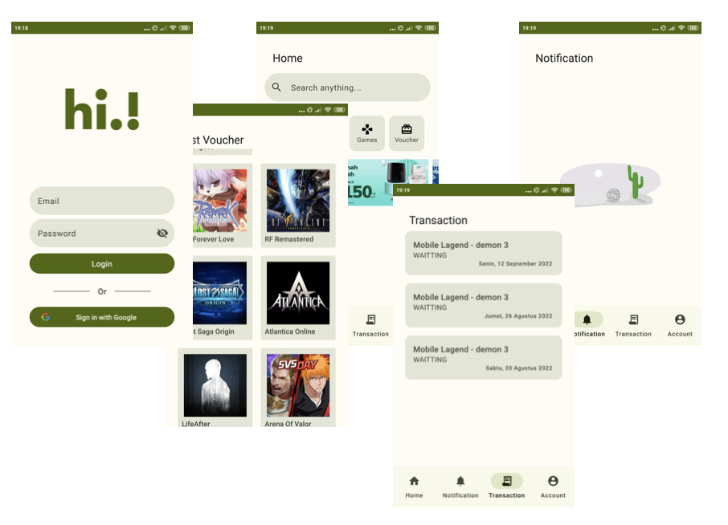

<!-- Project Kampung Pedia Apps -->
<!--
*** PPOB Apss And Local Services for helping UMKM
-->

<!-- PROJECT LOGO -->
<br />
<div align="center">
  <a href="https://github.com/dadangsetio/Kampung_Pedia">
    
  </a>

  <h3 align="center">Project Kampung Pedia Apps</h3>

  <p align="center">
    PPOB Apss And Local Services for helping UMKM
    <br />
    <a href="https://github.com/dadangsetio/Kampung_Pedia"><strong>Explore the docs »</strong></a>
    <br />
    <br />
  </p>
</div>


<!-- TABLE OF CONTENTS -->
<details>
  <summary>Table of Contents</summary>
  <ol>
    <li>
      <a href="#about-the-project">About The Project</a>
      <ul>
        <li><a href="#built-with">Built With</a></li>
      </ul>
    </li>
    <li>
      <a href="#getting-started">Getting Started</a>
      <ul>
        <li><a href="#prerequisites">Prerequisites</a></li>
        <li><a href="#installation">Installation</a></li>
      </ul>
    </li>
    <li><a href="#usage">Usage</a></li>
    <li><a href="#roadmap">Roadmap</a></li>
    <li><a href="#contributing">Contributing</a></li>
    <li><a href="#license">License</a></li>
    <li><a href="#contact">Contact</a></li>
    <li><a href="#acknowledgments">Acknowledgments</a></li>
  </ol>
</details>


<!-- ABOUT THE PROJECT -->
## About The Project


An app build on Kotlin with designed as Multi platform project or called as KMP (Kotlin Multi Platform). UI on build with Jetpack Compose with architechture fully Redux Manajement.

<p align="right">(<a href="#readme-top">back to top</a>)</p>


### Built With

* Kotlin
* Jetpack Compose
* Materal 3
* Voyager
* Lottie
* Koin 
* ML-kit

<p align="right">(<a href="#readme-top">back to top</a>)</p>


<!-- GETTING STARTED -->
### Prerequisites

* Android Studio

### Installation

1. Clone the repo
   ```sh
   git clone https://github.com/dadangsetio/Kampung_Pedia.git
   ```
2. Run

<p align="right">(<a href="#readme-top">back to top</a>)</p>

